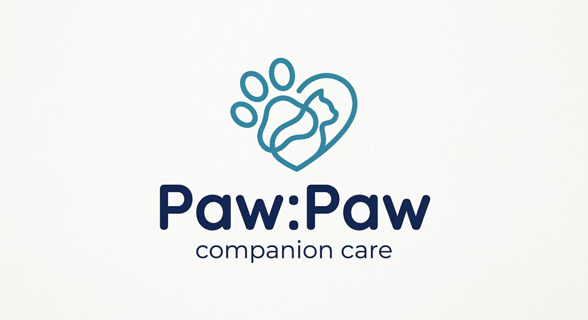

<div align="center">



# 🐾 Paw:Paw

### AI가 분석하고, 대시보드가 기억하는 — 나만의 반려동물 케어 플랫폼

[](https://reactjs.org/)
[](https://fastapi.tiangolo.com/)
[](https://mongodb.com/)
[](https://openai.com/)
[](https://vercel.com/)
[](https://railway.app/)

</div>

---

## 📌 Overview

반려동물의 건강기록, 예방접종, 식단 정보를 한 눈에 관리하고,  
AI 기반 맞춤 케어 레포팅과 반려인 커뮤니티를 제공하는 **반려동물 통합 관리 웹 서비스**입니다.

> 팀 **404 Thinking**의 사이드 프로젝트

---

## ✨ Key Features

- 🏠 **대시보드** — 반려동물 캐릭터 애니메이션과 함께 건강·식사·접종 정보를 한 눈에
- 🤖 **AI 레포팅** — 주기적으로 갱신된 데이터를 기반으로 건강·식단·활동 맞춤 리포트 제공
- 💬 **AI 챗봇** — 내 반려동물 데이터 기반 맞춤형 케어 질의응답
- 🐶 **커뮤니티** — 반려동물 자랑 피드 및 정보 공유 게시판
- 🔔 **스마트 알림** — 식사 시간, 예방접종 D-Day 등 시간 기반 말풍선 알림

---

## 🛠 Tech Stack

| 분류 | 기술 |
|------|------|
| Frontend | React.js, Tailwind CSS, Lottie, Axios |
| Backend | FastAPI (Python) |
| Database | MongoDB Atlas, motor (비동기 드라이버) |
| 인증 | JWT |
| AI | OpenAI API (GPT-4o) |
| 배포 | Vercel (Frontend), Railway (Backend) |

---

## 🚀 Deployment

| 서비스 | 플랫폼 | URL |
|--------|--------|-----|
| Frontend | Vercel | 추후 작성 |
| Backend | Railway | 추후 작성 |
| Database | MongoDB Atlas | — |

---

## 🖥 Getting Started

### 요구사항

- Node.js 18+
- Python 3.11+
- MongoDB Atlas 계정

### Frontend

```bash
cd client
npm install
npm run dev
```

### Backend

```bash
cd server
python -m venv venv
source venv/bin/activate  # Windows: venv\Scripts\activate
pip install -r requirements.txt
uvicorn main:app --reload
```

### 환경변수 설정

프론트엔드와 백엔드가 각자 자신의 디렉토리에서 환경변수를 로드하므로, `.env`도 각 디렉토리에 나누어 설정합니다.

```bash
# Backend
cp server/.env.example server/.env
# server/.env 파일에 값 입력 후 실행

# Frontend
cp client/.env.example client/.env
# client/.env 파일에 값 입력 후 실행
```

```bash
# server/.env.example
PORT=8000
MONGO_URI=
OPENAI_API_KEY=
JWT_SECRET=
```

```bash
# client/.env.example
VITE_API_URL=http://localhost:8000
```

---

## 📁 Project Structure

```
paw-paw/
├── client/                  # React 프론트엔드
│   ├── src/
│   │   ├── api/             # axios 인스턴스, 엔드포인트 상수
│   │   ├── components/
│   │   ├── pages/
│   │   └── assets/
│   ├── .env.example
│   └── package.json
│
├── server/                  # FastAPI 백엔드
│   ├── app/
│   │   ├── api/
│   │   │   └── routes/      # pet, user, community, report, chat
│   │   ├── models/          # MongoDB 스키마 (Pydantic)
│   │   ├── services/        # AI 레포팅, 챗봇, 스케줄러
│   │   └── core/            # DB 연결, 환경변수
│   ├── .env.example
│   ├── main.py
│   └── requirements.txt
│
├── .gitignore
└── README.md
```

---

## 👥 Team 404 Thinking

| 이름 | 역할 |
|------|------|
| [정재훈] | 팀장 / 기획 / 디자인 |
| [이지원] | 기획 / 디자인 |
| [조한별] | 프론트엔드 |
| [김학래] | 백엔드 |

---

## 📄 License

MIT License © 2025 404 Thinking
